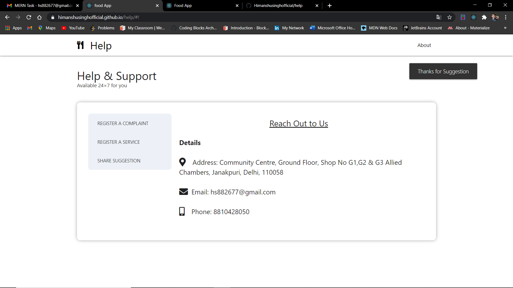
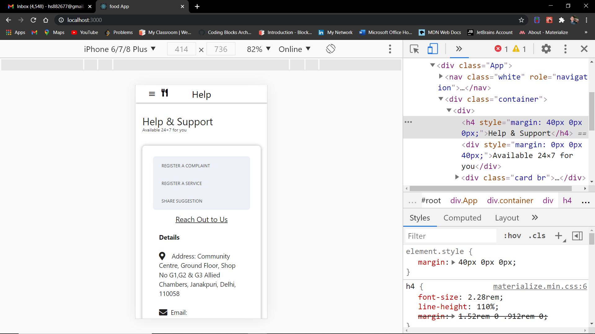

# Help Page-:mortar_board:

 
Front End: ReactJS 
Instructions: 
1.used basic concepts of ReactJS 
2.used routing, redux 
3.wrote a clear & clean code with proper comments. 
4.used ui frameworks like bootstrap, material etc. 
 
Help section contains 
1.Reach out to us 
2.Register a complaint 
3.Register a service 
4.Share Suggestion 

Help Screen : 
* Help section page This will have sections like register a complaint, request a service, share suggestions, and reach out to us 
* Contains information(about us) in right side of screen 
* On clicking rest of tab a form is Popup and you can fill required details then click on submit all that information sent to store in json-server 

## `How to Run`   
1) git clone https://github.com/Himanshusinghofficial/help.git 
2) cd help 
3) npm install 
4) npm run dev 

## `Made by: Himanshu Singh & Email:hs882677@gmail.com`

## `I Used` :smiley:  
1) React-Redux (FrontEnd) :heart: 
2) Materializecss/Css (Styling)  
3) Json-Server (DB Operations)  

## `Some ScreenShots` :camera:
### `Desktop View` :computer:

#### `Image 1: Help Page`

#### `Image 2-3: Register a Complaint`

#### `Image 4-5: Register a Service`

#### `Image 6-7: Share Suggestions`

#### `Image 8-9: Notification PopUp In All Three Help Section For Ex(Share Suggestion)`

### `Mobile View` :iphone:

#### `Image 10-11: Help Page (Responsive)`

#### `Image 12: Menu-Toggle (Responsive)`

#### `Image 13-14: Register a Complaint (Responsive)`

#### `Image 15-16: Register a Service (Responsive)`

#### `Image 17-18: Share Suggestion (Responsive)`

#### `Image 19-20: Notification PopUp In All Three Help Section For Ex(Register Compalint) (Responsive)`

### `Thanks You` :raised_hands:
